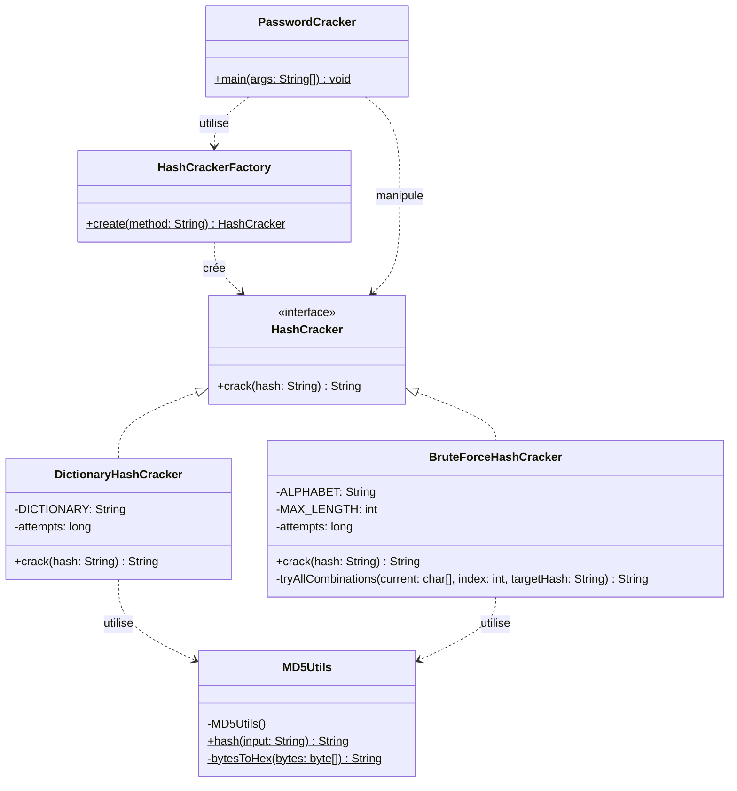
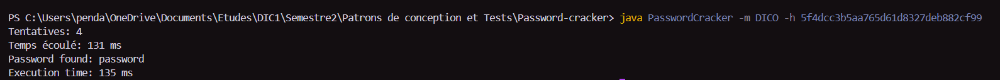
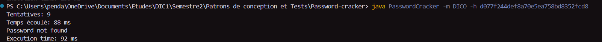
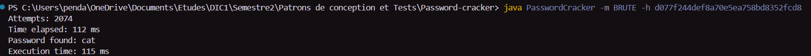
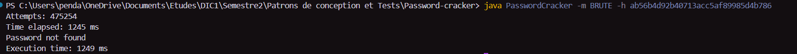

# Password-cracker
Mini-projet 1 — DIC1, Design Patterns

## 1. Introduction

`PasswordCracker` est un outil en ligne de commande destiné à retrouver un mot de passe à partir de son empreinte **MD5**, dans un contexte pédagogique d'audit de sécurité. Cette première version (v1) du projet vise avant tout à mettre en pratique le patron de conception créationnel **Simple Factory** : l'objectif n'est pas seulement de casser des hashs, mais de structurer le code de façon à ce que le choix de la stratégie de cassage (dictionnaire ou force brute) soit entièrement découplé du reste du programme.

## 2. Présentation du problème

Un mot de passe stocké sous forme de hash MD5 ne peut pas être « déchiffré » directement : MD5 n'est pas un algorithme de chiffrement réversible, mais une fonction de hachage à sens unique. La seule façon de retrouver le mot de passe d'origine est de **hasher des candidats et comparer le résultat** au hash recherché, jusqu'à trouver une correspondance.

Le sujet impose deux stratégies de cassage, correspondant à deux compromis très différents en pratique :

- **Cassage par dictionnaire (`DICO`)** : rapide et efficace si le mot de passe figure dans une liste de mots courants, mais ne peut retrouver que des mots déjà connus.
- **Cassage par force brute (`BRUTE`)** : exhaustif (toutes les combinaisons de `a` à `z`, jusqu'à 4 caractères), garanti de trouver le mot de passe s'il respecte ces contraintes, mais avec un coût en temps qui croît très vite avec la longueur (26 candidats pour 1 caractère, jusqu'à 456 976 pour 4 caractères, soit 475 254 combinaisons testées au total dans le pire cas).

Le programme permet de choisir l'une ou l'autre stratégie via l'option `-m` (`BRUTE` ou `DICO`), en fournissant le hash cible via `-h`.

## 3. Architecture

Le projet suit une architecture modulaire où chaque classe a une responsabilité unique et clairement délimitée :

|Classe|Rôle|
|---|---|
|`HashCracker` (interface)|Contrat commun à toute stratégie de cassage : une seule méthode `crack(String hash)`, qui retourne le mot de passe trouvé ou `null`.|
|`DictionaryHashCracker`|Implémentation concrète : parcourt `dictionary.txt` ligne par ligne, hashe chaque mot et le compare au hash recherché.|
|`BruteForceHashCracker`|Implémentation concrète : génère récursivement toutes les combinaisons possibles de l'alphabet `a-z`, longueur 1 à 4, jusqu'à trouver une correspondance.|
|`MD5Utils`|Classe utilitaire non instanciable (constructeur privé) centralisant le calcul du hash MD5 d'une chaîne, afin d'éviter la duplication de cette logique dans les deux stratégies.|
|`HashCrackerFactory`|Fabrique simple : centralise la création des objets `HashCracker` à partir d'une chaîne (`"BRUTE"` ou `"DICO"`, normalisée en majuscules), pour que le reste du programme ne connaisse jamais les classes concrètes. Lève une `IllegalArgumentException` si la méthode est `null` ou inconnue.|
|`PasswordCracker`|Point d'entrée du programme : lit les arguments de la ligne de commande (`-m`, `-h`), délègue la création de la stratégie à la fabrique, lance le cassage, mesure le temps total et affiche le résultat.|

Grâce à cette séparation, le code métier de cassage (`DictionaryHashCracker`, `BruteForceHashCracker`) est totalement indépendant de la logique d'interface en ligne de commande (`PasswordCracker`), et le point de couture entre les deux est unique : la fabrique.

## 4. Diagramme UML



## 5. Usage du patron Simple Factory

Le patron **Simple Factory** est appliqué à travers la classe `HashCrackerFactory`, qui centralise toute la logique de création des objets `HashCracker` :

```java
public static HashCracker create(String method) {
    if (method == null) {
        throw new IllegalArgumentException("La méthode de cassage ne peut pas être nulle.");
    }
    switch (method.toUpperCase()) {
        case "BRUTE":
            return new BruteForceHashCracker();
        case "DICO":
            return new DictionaryHashCracker();
        default:
            throw new IllegalArgumentException("Méthode de cassage inconnue : " + method);
    }
}
```

`PasswordCracker` (le code appelant) ne manipule jamais directement `DictionaryHashCracker` ou `BruteForceHashCracker` : il ne connaît que l'interface `HashCracker` et la fabrique.

```java
HashCracker cracker = HashCrackerFactory.create(method);
String result = cracker.crack(hash);
```

Cette indirection apporte deux bénéfices concrets dans ce projet :

- **Découplage** : `PasswordCracker` ne dépend d'aucune classe concrète de cassage, seulement de l'interface `HashCracker`.
- **Centralisation** : toute la logique de sélection de la stratégie est regroupée en un seul endroit (avec, au passage, la normalisation de la casse et la validation des entrées), plutôt que dispersée sous forme de `if`/`switch` dans le code appelant.

_Limite à noter : ajouter une nouvelle stratégie de cassage impose tout de même de modifier le corps de `HashCrackerFactory.create()` — la fabrique simple ne respecte donc pas strictement le principe Open/Closed. Cette limitation est une transition volontaire vers le mini-projet suivant._

## 6. Résultats obtenus

Le projet compile sans erreur (`javac *.java`) et a été testé avec succès sur plusieurs scénarios, en ligne de commande (`java PasswordCracker -m <méthode> -h <hash>`).

### Cassage par dictionnaire — cas trouvé


### Cassage par dictionnaire — cas non trouvé


(9 tentatives = les 9 mots du fichier `dictionary.txt`, le hash recherché — celui de `cat` — n'y figurant pas.)

### Cassage par force brute — cas trouvé

### Cassage par force brute — cas non trouvé (hors limite de longueur)



Ce dernier test utilise le hash du mot `abcde` (5 caractères) : la limite `MAX_LENGTH = 4` de `BruteForceHashCracker` est donc atteinte sans succès, après avoir exploré l'intégralité des 475 254 combinaisons possibles (26 + 26² + 26³ + 26⁴) — ce qui confirme le caractère exhaustif de la recherche dans les bornes fixées.

### Gestion des erreurs


Les deux cas sont gérés proprement (message clair, pas de plantage), respectivement via l'exception levée par la fabrique et via la validation des arguments dans `PasswordCracker.main()`.

## 7. Difficultés rencontrées

**Lecture du dictionnaire avec `Scanner.nextLine()`**

L'une des difficultés rencontrées par le groupe a porté sur la lecture du fichier `dictionary.txt` avec la méthode `nextLine()` de `Scanner`. Cette méthode lit le contenu d'une ligne de façon relativement littérale : si le fichier contient des espaces ou des tabulations en fin ou en début de ligne, ils sont intégralement pris en compte dans la chaîne lue. Or un mot comportant un espace ou une tabulation superflue ne produit pas le même hash MD5 que le mot « propre » (ex. `"admin "` et `"admin"` ont des hashs différents), ce qui empêchait certaines correspondances d'être détectées même lorsque le mot recherché figurait bel et bien dans le dictionnaire.

La correction a consisté à nettoyer chaque ligne lue avec `.trim()` avant de calculer son hash :

java

```java
String word = scanner.nextLine().trim();
```

## 8. Conclusion

Ce premier mini-projet a permis de mettre en œuvre une architecture orientée objet modulaire autour d'un problème concret : retrouver un mot de passe à partir de son empreinte MD5, selon deux stratégies aux compromis très différents (dictionnaire rapide mais limité, force brute exhaustive mais coûteuse).

Sur le plan de la conception, le patron **Simple Factory** a rempli son rôle : `PasswordCracker` ne connaît jamais les classes concrètes `DictionaryHashCracker` ou `BruteForceHashCracker`, il ne manipule que l'interface `HashCracker` et délègue leur création à `HashCrackerFactory`. Cette indirection s'est révélée particulièrement lisible et facile à tester, chaque stratégie pouvant être développée et validée indépendamment grâce au **polymorphisme** offert par l'interface commune.

Le projet a aussi montré les limites propres à une fabrique _simple_ : contrairement à une Factory Method ou une Abstract Factory, `HashCrackerFactory.create()` doit être modifiée à chaque ajout d'une nouvelle stratégie, ce qui viole le principe **Open/Closed**. Ce n'est pas un défaut de l'implémentation, mais une limite structurelle du patron choisi — assumée ici puisque le sujet annonce explicitement qu'elle sera corrigée dans le mini-projet suivant, probablement via un patron de création plus extensible.

Enfin, la difficulté rencontrée sur la lecture du dictionnaire (espaces et tabulations non nettoyés faussant la comparaison de hash) a rappelé une leçon plus générale : dans un outil de sécurité où la moindre différence de caractère change complètement le résultat d'un hash, la robustesse du traitement des entrées (nettoyage, normalisation) est aussi importante que la justesse algorithmique elle-même.

Au global, les objectifs pédagogiques du mini-projet — conception modulaire, polymorphisme, mise en œuvre du Simple Factory, et compréhension de ses limites — ont été atteints.

---
## Prérequis et exécution

- **JDK** : Java 11 ou supérieur (testé avec OpenJDK 21)
- Le fichier `dictionary.txt` doit être présent dans le répertoire d'exécution pour la stratégie `DICO`.

```bash
javac *.java
java PasswordCracker -m DICO -h <hash_md5>
java PasswordCracker -m BRUTE -h <hash_md5>
```
